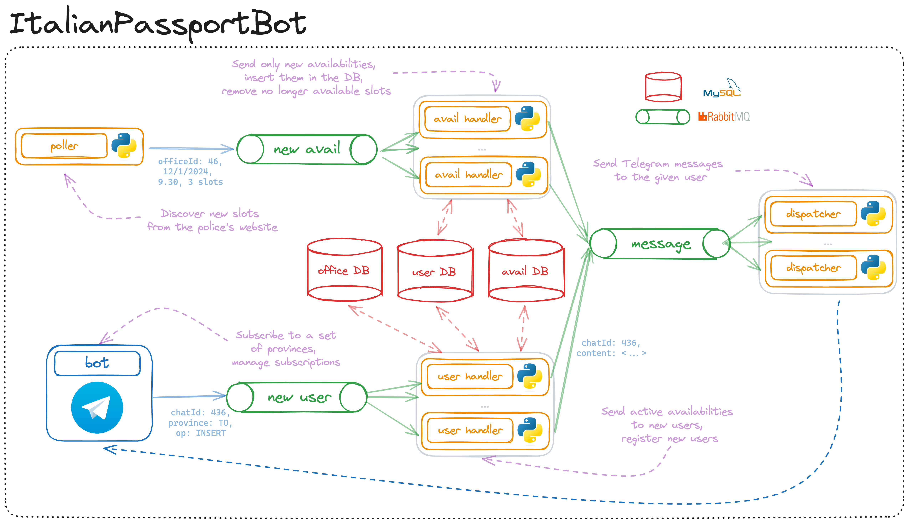
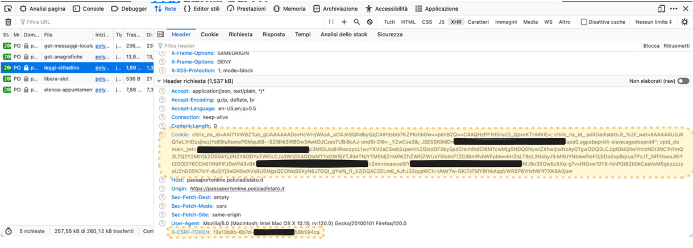
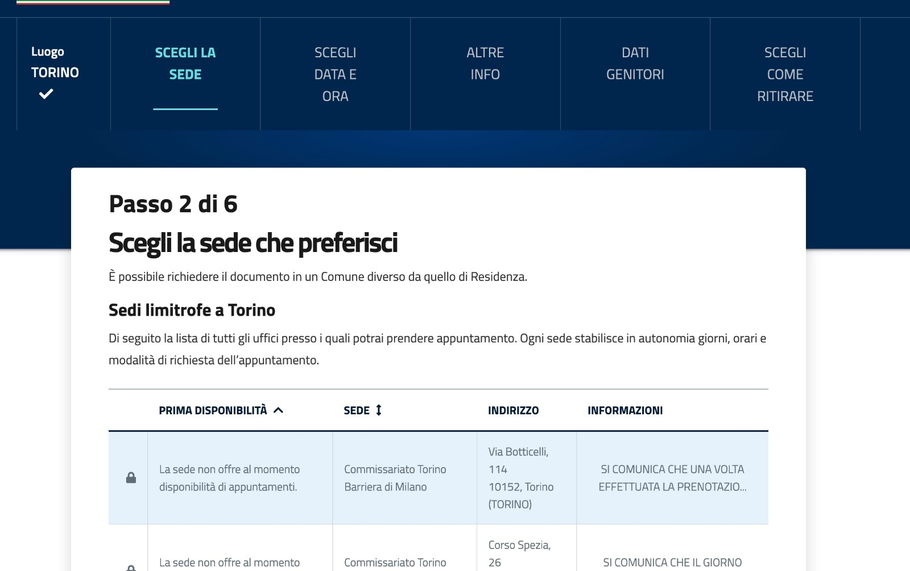

**TODOS**

System Side

1. [ ] Persist MySQL data in a mounted directory
2. [x] Configure user and pass for rabbitMQ. Update common dockerfile and common queue.py as well
3. [x] Create docker container for the bot. Expose it to internet
4. [x] Check if the dispatcher can send messages correctly
5. [ ] Scale the solution using Kubernetes (see if docker compose can handle multiple containers of the same service)

Script
1. [ ] Adapt script from jupyter

Frontend
1. [ ] Improve and containerize Streamlit container


# Italian Passport Bot

<!-- TOC -->
* [Italian Passport Bot](#italian-passport-bot)
  * [The problem](#the-problem)
  * [The System](#the-system)
    * [Overview](#overview)
    * [User path](#user-path)
    * [Availability path](#availability-path)
  * [The Script](#the-script)
<!-- TOC -->

## The problem

Obtaining a passport in Italy is challenging. In many provinces, there is no availability 
or the first ones are several months away. 
Some provinces offer *open days* without reservations,
where typically thousands of people show up from the early hours of the night. Read more [here](https://www.lastampa.it/torino/2023/01/28/news/passaporti_ufficio_code-12609734/) and [here](https://www.rainews.it/tgr/piemonte/video/2023/10/a-torino-passaporto-in-20-giorni-ma-e-ancora-caos-per-la-domanda--dff5c3e4-6801-405f-9cd2-fd1e7c7cbe5d.html).

|                                                                                                                                                                                         | 
|:---------------------------------------------------------------------------------------------------------------------------------------------------------------------------------------------------------------------:| 
| **Left**: *Red regions have no available slots at the moment of polling*, **Right**: *queue during an open day. Picture from [[1]](https://www.lastampa.it/torino/2023/01/28/news/passaporti_ufficio_code-12609734/)* |


There are **two ways to book an appointment**: the first is to wait for the offices to publish new availability,
the second is to book slots cancelled by other citizens.

An available slot can only be booked after hour X, 
which varies from office to office, but for most, it is 9 am.
Typically, the police station publishes the new slots after midnight. As a result, at 9 a.m. the next morning many citizens compete for available slots, exhausting them after only a few minutes. 
Booking in this way is not optimal for two reasons: the first is that the police headquarters publishes new availabilities for slots **months apart** (typically 6), and the second is that **the system does not handle the slot lock correctly**. 
The system tells you that you have blocked that slot for the next 15 minutes but, when confirming the booking, it often happens that the slot has already been booked by another user.

This project serves to **simplify the second option** by promptly receiving a message on Telegram as soon as a slot becomes free. 
These slots are much less competitive (as they appear at random times of the day) and are often after few days from booking. 
Moreover, as there is a smaller load, the system can block the slot correctly during the booking.

As soon as a slot becomes free, the user receives a message like:
```
New availability:
First Date: 19/12/2023
Availability:
   19/12/2023 5 p.m. Available slots: 1
   20/12/2023 at 9 a.m. Available slots: 1
Office: TOPQ60 - Turin Police Headquarters
Address: Piazza Cesare Augusto, 5 TORINO
```

This system is mainly an exercise to learn how to use the new tools, to be able to scale to a large number of users and availability.
At the moment, **it is not active** because polling the police website **requires a cookie** (containing the SPID JWT) and the **X-CSRF token**, which are personal. 
They can be easily obtained by inspecting the HTTP requests made to the site.
The system is described below. In addition, a **standalone script** and instructions for using it are provided.

## The System
### Overview
The system is a pub-sub via Telegram. 
The user subscribes to a list of provinces and a series of scripts take care of **discovering new availabilities** and **sending messages to all subscribed users**. 
Furthermore, the system only sends a message **the first time a slot is discovered** and keeps track of the evolution in a database (how many slots are available, when they were discovered, when they ran out, etc.).

<picture>
  <source media="(prefers-color-scheme: dark)" srcset="./assets/SystemDark.png">
  
</picture>

The two main components of this system are the frontend bot and the poller. The former takes care of registering users to the provinces they are interested in, the latter handles the discovery of new availabilities.

### User path

Through a guided interface, the user can register for a new province or unsubscribe from previously selected ones. 
As soon as the operation is confirmed, the bot publishes a new message on the `new_user` queue. This message contains:
```
{
"chat_id": int, 
"province": Optional[str] (None for REMOVE ALL command), 
"operation": one of INSERT, REMOVE, REMOVE ALL
}
```

The messages in this queue are consumed by the `new_user_handler`, which reads the message, performs the operation on the `UserDB` database and acknowledges the queue. 
In addition, if the user subscribes **to a province that the system is actively monitoring**, a summary message is sent with all discovered and still available slots. 
This message is produced using the `availability` and `office` databases (a join is needed to identify the province given an office ID) 
and posted to the `message` queue. It is then read by a `telegram_dispatcher` and sent to the user.

### Availability path

The poller is in charge of discovering new availabilities from the police site. 
This is done by making a POST request, obtaining a set of dates, and then making another request to obtain the times and number of places. 

If the slot is **bookable** (i.e., at the time of polling, bookings for that office are open), 
a message is posted on the `new_availabilities` queue. 

If the slot is **not bookable but will be in the next 5 minutes**, a message is posted too. 
Since these slots are much more competitive, it is better to send the message in advance rather than when 
it is actually available. To differentiate, an available slot has the command `INSERT` while a future slot has `INSERT SCHEDULED`.

Otherwise, the slot is ignored since, as it is not bookable, it will also be found in subsequent polling.

Messages on the `new_availabilities` queue follow this format:

```
{
"province": str,
"availability": json returned by the website (hour, slots, day etc),
"operation": "INSERT SCHEDULED" or "INSERT",
}
```

In addition, a `SET INACTIVE` message can also be placed on this queue, which is used to update entries.
It transmits all the entries found for the province and the consumer takes care of updating the DB.

The consumer, avail_handler, reads the message and based on the operation field calls a different callback.
The `INSERT (SCHEDULED)` operations are identical except the message sent is slightly different. 
The script takes the entry and checks that it is not already in the database. 
If it has not already been discovered, it finds all the users subscribed to that province and prepares a message with the date and time 
(`INSERT` with header "New availability", `INSERT SCHEDULED` with header "New availability at X hours"). 
The message and `chat_id` on the `message` queue is then posted.

If the operation is `SET INACTIVE`, the script takes care of removing the no longer available slots 
and updating the slots for the selected province based on the results of the query. 
It identifies a list of `ids` that should be updated (`to_be_updated`) and a list 
that should be recorded as no longer available (`to_be_set_inactive`) and performs the `UPDATE` operations. 
This operation places no message on the `message` queue, but in the future the user may be given the opportunity to receive a message even when the slot stops being available.


## The Script

The script can be used to find out availability, without the flexibility of the system described above.
The script is more than sufficient for a strictly personal purpose.

To execute the script, the tokens mentioned above are needed. Below are the instructions

1. Log on to the police website https://passaportonline.poliziadistato.it/
2. Inspect HTTP requests made after the login (typically right-click, inspect and then network section)
3. Locate the _`Cookie`_ and `X-CSRF-TOKEN` fields in the header of the REQUESTS. See a screenshot below.
4. Copy these tokens into the `cookie_token` and `xcsrf_token` files respectively
5. Repeat this operation as soon as the site responds with `403` to requests





Finally, a telegram bot is needed. It is possible to create one ad-hoc, or use a specially created one. 
The latter option requires:

1. Start a conversation with this [bot](https://t.me/ModynBot)
2. Find your chat_id (can be done by sending a message to [this bot](https://t.me/myidbot))
3. Save your chat_id in the constant `CHAT_ID_TELEGRAM`

After that, start the script `standalone_script.py` and, as soon as a spot becomes available, 
you will receive a message from the first bot. 
In the meantime, you can pre-fill the fields in the first section and keep a tab open on the calendar (see photo below) 
to book as soon as the slot is discovered.



