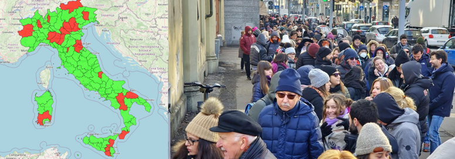

# Italian Passport Bot

## The problem

Obtaining a passport in Italy is challenging. In many provinces, there is no availability 
or the first ones are several months away. Some provinces offer open days without reservations, where thousands of people show up from the early hours of the night.

|                                                                                   | 
|:---------------------------------------------------------------------------------------------------------------:| 
| **Left**: *Red regions have no available slots at the moment of polling*, **Right**: *queue during an open day* |


There are **two ways to book an appointment**: the first is to wait for the offices to publish new availability,
the second is to book slots cancelled by other citizens.

An available slot can only be booked after hour X, 
which varies from office to office, but for most, it is 9 am.
Typically, the police station publishes the new slots after midnight. As a result, at 9 a.m. the next morning many citizens compete for available slots, exhausting them after only a few minutes. 
Booking in this way is not optimal for two reasons: the first is that the police headquarters publishes new availabilities for slots **months apart** (typically 6), and the second is that **the system does not handle the slot lock correctly**. 
The system tells you that you have blocked that slot for the next 15 minutes but, when confirming the booking, it often happens that the slot has already been booked by another user.

This project serves to **simplify the second option** by promptly receiving a message on Telegram as soon as a slot becomes free. 
These slots are much less competitive (as they appear at random times of the day) and are often after few days from booking. 
Moreover, as there is a smaller load, the system can block the slot correctly during the booking.

As soon as a slot becomes free, the user receives a message like:
```
New availability:
First Date: 19/12/2023
Availability:
   19/12/2023 5 p.m. Available slots: 1
   20/12/2023 at 9 a.m. Available slots: 1
Venue: TOPQ60 - Turin Police Headquarters
Address: Piazza Cesare Augusto, 5 TORINO
```

## The system

